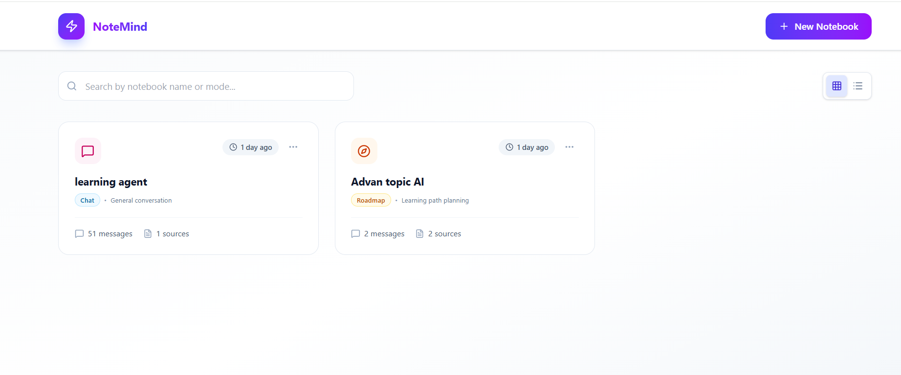
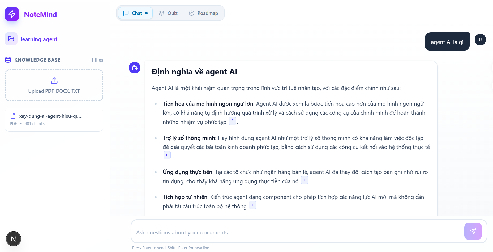
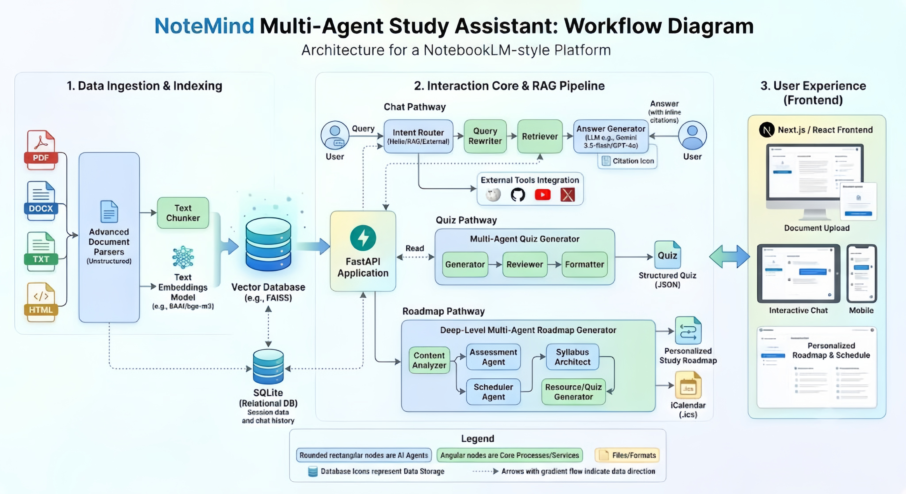

# NoteMind

NoteMind is an intelligent **RAG Agent (Retrieval-Augmented Generation) & Note-Taking Assistant** that combines the power of Large Language Models (LLMs) with a local context search system and real-time lookup tools. It helps users efficiently manage knowledge, summarize documents, and query multi-source information.



---

## 🚀 Project Overview

NoteMind is a Full-Stack application (independent Frontend & Backend) featuring:
- **Advanced RAG System (Retrieval-Augmented Generation)**: Supports uploading, advanced parsing, and contextual indexing for various document formats (PDF, Word, Excel, PPTX, HTML, etc.) into a local vector database (FAISS) using state-of-the-art embedding models (`BAAI/bge-m3`).
- **Intelligent Orchestration Agent**: Utilizes **LangGraph** to coordinate chat tasks, autonomously deciding when to call external tools (Wikipedia, GitHub, Academic Search, etc.) based on user queries.
- **Multi-LLM Integration**: Supports Google AI Studio (Gemini), GitHub Models (Azure Inference), OpenRouter, and local models via `llama-cpp-python`.
- **Modern User Interface**: Delivers a seamless chat experience, displays the Agent's thought process and tool execution, and supports Markdown rendering, mathematical formulas, and clear source citations.



---

## 🔄 Workflow



---

## 🛠️ Technologies & Libraries

### 1. Backend (Python/FastAPI)
- **Core Web Framework**: `FastAPI`, `Uvicorn` (High-performance API building with automatic OpenAPI/Swagger documentation).
- **Agentic AI & LLMs**: `LangGraph` (Agent flow orchestration), `google-genai` SDK, `openai` SDK (GitHub Models and OpenRouter integration), `llama-cpp-python` (Local model execution).
- **Vector Database & Embeddings**: `FAISS` (Local vector database for similarity search), `sentence-transformers` (High-quality embeddings using `BAAI/bge-m3`).
- **Advanced Document Processing**:
  - `unstructured`, `pdfplumber`, `pdfminer.six` (PDF parsing).
  - `python-docx`, `python-pptx`, `openpyxl` (Office document reading).
  - `trafilatura`, `beautifulsoup4` (Web scraping and text extraction).
  - `pytesseract` (OCR support for images/scanned documents).
  - `langchain-core` & `langchain-community` (Semantic chunking and text processing).

### 2. Frontend (React/Next.js)
- **Framework & Routing**: `Next.js 15` (App Router), `React 19`.
- **Styling & UI**: `Tailwind CSS 4.x`, `Framer Motion` (Smooth animations), `Radix UI` (Primitive UI components), `Lucide React` (Iconography).
- **State & Data Management**: `@tanstack/react-query` (Caching, server state synchronization), `Axios` (HTTP client).
- **Rendering**: `react-markdown`, `remark-gfm` (Professional Markdown rendering, tables, and citations).

---

## 🏆 Key Features & Achievements
- **Intelligent Conversational Experience**: Answers questions based on static data and dynamically searches for academic info, GitHub, or Wikipedia when detecting the need for up-to-date or specialized data.
- **Accurate Contextual Search**: Semantic search over large documents provides direct answers based on uploaded files (PDF, Word, Excel, etc.) along with precise reference source citations.
- **Optimized & Intuitive UI**: Users can track every processing step of the Agent (searching documents, accessing Wikipedia, thinking, etc.), providing a transparent and modern interactive experience.

---

## 📋 Prerequisites

- Python 3.11+ (Recommended)
- Node.js 20+
- `pip`
- `npm` or `pnpm`

---

## ⚙️ Installation

1. Clone the repository:

```bash
git clone <repo-url>
cd NoteMind
```

2. Install Python dependencies for the backend:

```bash
cd backend
python -m venv .venv
# On Windows
.venv\Scripts\activate
# On Linux/macOS
# source .venv/bin/activate
pip install --upgrade pip
pip install -r requirements.txt
```

3. Install frontend dependencies:

```bash
cd ../frontend
npm install
```
> Note: Run `npm install` to install all packages before running `npm run dev`.

---

## 🔑 API Key Configuration

The project uses environment variables from a `.env` file located in the root directory.

### 1. Google AI Studio (Gemini)

- Go to **Google AI Studio**: [https://aistudio.google.com/](https://aistudio.google.com/)
- Sign in with your Google account.
- Click on **"Get API key"** in the top left corner.
- Select **"Create API key"**, choose an appropriate project, and click create.
- Copy the Key and paste it into the `.env` file:

```env
GEMINI_API_KEY=your_google_ai_studio_api_key
GOOGLE_API_BASE=https://generativelanguage.googleapis.com/v1beta/openai/
```
> Note: `GOOGLE_API_BASE` is already set to a default value, change it only if you use a custom endpoint.

### 2. GitHub Models / GitHub Inference

The project uses the OpenAI-compatible endpoint from GitHub Models via Azure.

- Create a suitable access token from GitHub:
  - `Settings` > `Developer settings` > `Personal access tokens`
  - Or use an organizational GitHub Models / Copilot token if provided.
- If you have your own endpoint (e.g., `https://models.inference.ai.azure.com`), keep the default or replace it with yours.
- Add to `.env`:

```env
GITHUB_TOKEN=your_github_models_token
GITHUB_BASE_URL=https://models.inference.ai.azure.com
```
> If you don't have access to GitHub Models, you can use the OpenRouter fallback by configuring `OPENROUTER_API_KEY`.

### 3. Example `.env`

```env
EMBEDDING_MODEL=BAAI/bge-m3

# Google AI Studio
GOOGLE_API_BASE=https://generativelanguage.googleapis.com/v1beta/openai/
GEMINI_API_KEY=your_google_api_key

# GitHub Models
GITHUB_BASE_URL=https://models.inference.ai.azure.com
GITHUB_TOKEN=your_github_token

# OpenRouter (Optional)
OPENROUTER_BASE_URL=https://openrouter.ai/api/v1
OPENROUTER_API_KEY=your_openrouter_key
```

---

## 🚀 Running the Project

### Backend

```bash
cd backend
.venv\Scripts\activate
uvicorn main:app --reload --host 0.0.0.0 --port 8000
```
Once running, the backend API will be available at:
- `http://localhost:8000/health`
- `http://localhost:8000/docs`

### Frontend

```bash
cd frontend
npm run dev
```
By default, the frontend runs at `http://localhost:3000`.
