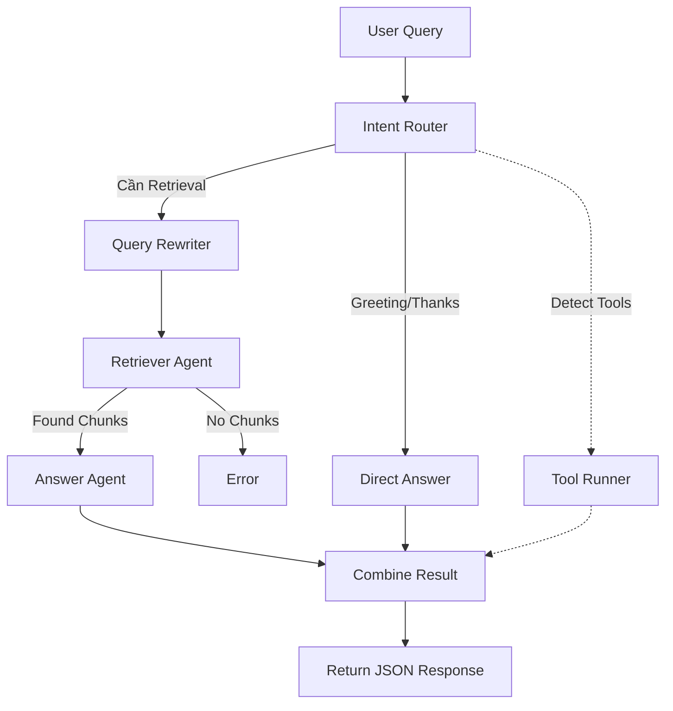

# Tài liệu chức năng Chat và Flow Agent (Cập nhật)

## 1. Mục đích chức năng Chat

Chức năng Chat trong dự án cho phép người dùng đặt câu hỏi trực tiếp lên bộ tài liệu đã upload vào Notebook. Các mục tiêu chính bao gồm:

- Trả lời các câu hỏi dựa trên ngữ cảnh tài liệu đã được nhúng (vectorized).
- Có khả năng hiểu ngữ cảnh hội thoại (nhờ lưu trữ session và history).
- Đảm bảo câu trả lời luôn được dẫn nguồn cụ thể (inline citations).
- Hiển thị tiến trình xử lý (workflow log) minh bạch cho người dùng.
- Hỗ trợ công cụ mở rộng (Tool Enrichment) khi cần thiết thông qua các triggers.

## 2. Kiến trúc Backend và Entrypoint

### 2.1. Endpoint chính

- **`POST /notebooks/{notebook_id}/ask`**
  Endpoint này được gọi từ frontend khi người dùng gửi một tin nhắn trong không gian làm việc (workspace).

### 2.2. Payload Request

Các trường dữ liệu cơ bản bao gồm:
- `query`: Nội dung câu hỏi từ người dùng.
- `mode`: Chế độ hoạt động (ở đây là `chat`).
- `top_k`: Số lượng document chunks cần truy xuất.
- `session_id`: ID của phiên làm việc hiện tại (nếu có).
- `doc_ids`: Danh sách các tài liệu giới hạn phạm vi truy vấn (tuỳ chọn).

### 2.3. Response

- `answer`: Đáp án chi tiết từ Assistant (định dạng Markdown).
- `sources`: Danh sách tài liệu tham khảo được dùng để trả lời.
- `citations`: Các trích dẫn chi tiết trong bài (với mã `[A]`, `[B]`,...).
- `workflow_log`: Nhật ký các bước agent đã chạy.
- `tools_data`: Dữ liệu bổ sung nếu có chạy các công cụ phụ trợ.

## 3. Luồng xử lý tổng quan

1. **Gửi câu hỏi**: Người dùng nhập tin nhắn từ frontend (`ChatView`).
2. **Khởi tạo trạng thái (State)**: Backend tiếp nhận request, lấy ra lịch sử `conversation_context` từ `sqlite_memory.py`. Trạng thái ban đầu (`NotebookState`) được khởi tạo.
3. **Phân phối luồng**: `NotebookOrchestrator` nhận diện `mode="chat"` và chuyển công việc cho `run_chat_workflow` trong file `backend/agents/chat/workflow.py`.
4. **Thực thi đa tác tử (Multi-agent)**: Workflow chạy qua một chuỗi các agent theo thứ tự định sẵn.
5. **Cập nhật bộ nhớ**: Kết quả được lưu vào cơ sở dữ liệu để làm bối cảnh cho các câu hỏi tiếp theo.
6. **Hiển thị**: Frontend nhận JSON response và render Markdown với `ReactMarkdown`, cùng các citation links.

## 4. Flow Agent chi tiết cho mode Chat

Quá trình này được định nghĩa rõ trong `backend/agents/chat/workflow.py`.

### Bước 1: Intent Router (`IntentRouter`)
Đầu tiên, hệ thống phân tích ý định của câu hỏi.
- Kiểm tra xem đây có phải là câu hỏi thông thường hay chỉ là lời chào/cảm ơn.
- Phân tích các **tool triggers** (từ khoá kích hoạt tính năng mở rộng).
- **Nhánh phụ**: Nếu chỉ là câu chào (không cần truy xuất tài liệu), luồng sẽ đi thẳng tới bước *Tool Enrichment* (nếu có trigger) và trả về câu trả lời trực tiếp mà không cần qua LLM phân tích tài liệu.

### Bước 2: Query Rewriter (`QueryRewriteAgent`)
Trường hợp cần truy xuất tài liệu, câu hỏi sẽ được làm rõ.
- Hệ thống lấy `conversation_context` và các tin nhắn gần nhất.
- Dùng LLM để viết lại câu hỏi (`rewritten_query`) sao cho độc lập ngữ cảnh, giúp việc search vector chính xác nhất. Ví dụ: "Nó là gì?" -> "YOLOv8 là gì?".

### Bước 3: Retriever (`RetrieverAgent`)
Sử dụng câu hỏi đã được viết lại để truy vấn cơ sở dữ liệu.
- Lấy `top_k` chunks phù hợp nhất từ kho Vector Store (như FAISS).
- Thu thập thông tin metadata của các chunks (ID, văn bản gốc, tên tài liệu).
- **Xử lý ngoại lệ**: Nếu không có văn bản nào phù hợp, luồng dừng lại và báo lỗi *“No relevant content found...”*.

### Bước 4: Answer Generator (`AnswerAgent`)
Sinh câu trả lời.
- Nạp các nội dung truy xuất được (`retrieval_items`) vào prompt của LLM.
- **Quy tắc nghiêm ngặt**:
  1. LLM **chỉ** dùng thông tin từ context được cung cấp.
  2. Gắn trích dẫn cục bộ (inline citation) như `[A]`, `[B]`.
  3. Trả về đúng định dạng Markdown chuyên nghiệp.

### Bước 5: Tool Enrichment (`ToolRunner`)
Nếu Intent Router phát hiện các từ khoá (triggers) cụ thể trong câu hỏi, `ToolRunner` sẽ được kích hoạt để chạy song song các external tools. 
Hệ thống hiện tại hỗ trợ 4 tools tích hợp:
1. **Wikipedia Tool**: 
   - **Triggers**: "là gì", "nghĩa là", "định nghĩa", "what is", "explain"...
   - **Chức năng**: Lấy tóm tắt nhanh từ Wikipedia về một khái niệm để bổ sung kiến thức tổng quan.
2. **GitHub Tool**:
   - **Triggers**: "code", "source code", "repo", "implement", "ví dụ code"...
   - **Chức năng**: Tìm kiếm các repositories mã nguồn mở trên GitHub liên quan đến khái niệm đang thảo luận.
3. **YouTube Tool**:
   - **Triggers**: "video", "bài giảng", "hướng dẫn", "tutorial", "xem"...
   - **Chức năng**: Tìm kiếm các video hướng dẫn trực quan trên YouTube để người dùng dễ tiếp thu hơn.
4. **Academic Tool**:
   - **Triggers**: "bài báo", "paper", "nghiên cứu", "citation", "scholar"...
   - **Chức năng**: Truy xuất các bài báo khoa học, nguồn gốc nghiên cứu từ các cơ sở dữ liệu học thuật.

Kết quả của các tool được gom vào `tools_data` và trả về cùng response để Frontend hiển thị trong giao diện dưới dạng Widget (Panel mở rộng).

## 5. UI và Frontend (Rendering)

Sau khi xử lý, backend trả kết quả về `NotebookWorkspace.tsx` và `ChatView.tsx`.
- **Render Markdown**: UI sử dụng `react-markdown`, `remark-gfm` kết hợp với `@tailwindcss/typography` (`prose`) để chuyển hoá nội dung thành HTML chuẩn.
- **Trích dẫn (Citations)**: Backend trả về văn bản chứa mã `[A]`. Frontend tự động thay thế bằng thẻ `<button>` tương ứng có link `#citation-A` nhằm hiển thị nguồn trực quan, cho phép click để xem tên tài liệu gốc.
- **Stepper UI**: `workflow_log` trả về từ Backend sẽ được hiển thị như một chuỗi trạng thái hoạt động theo thời gian thực (đang phân tích ý định -> đang tìm tài liệu -> đang sinh câu trả lời...).

## 6. Sơ đồ Pipeline Agent

## 7. Tổng kết

Chức năng Chat tận dụng thiết kế kiến trúc Agent-based:
- Phân tách rõ ràng trách nhiệm: Routing, Rewriting, Retrieval, và Generation.
- Hạn chế tối đa ảo giác (hallucination) bằng cách ép LLM vào prompt trả lời trích dẫn khép kín.
- Giao diện Markdown thân thiện giúp hiển thị kết quả phân cấp khoa học cho người dùng.
