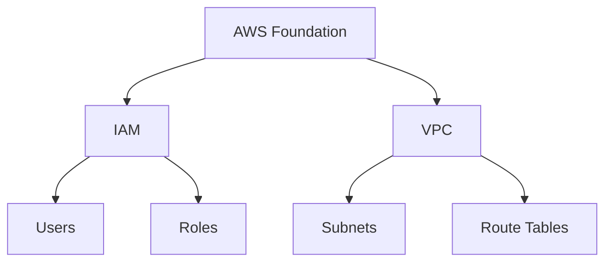

# Hệ Thống Multi-Agent Xây Dựng Lộ Trình Học Tập Cá Nhân Hóa

## 1. Các Thông Tin Đầu Vào Cần Thiết (Inputs)

Chỉ có tài liệu học tập là chưa đủ để xây dựng một lộ trình học tối ưu. Hệ thống cần kết hợp giữa **nội dung kiến thức** và **bối cảnh của người học** để tạo ra trải nghiệm cá nhân hóa.

### 1.1. Tài liệu gốc (Core Material)

* PDF
* DOCX
* Website / URL
* Slide bài giảng
* Video transcript

### 1.2. Mục tiêu học tập (Learning Goal)

Ví dụ:

* Học để đi làm
* Học để thi chứng chỉ (IELTS, AWS, PMP, ...)
* Học để nghiên cứu
* Học để hiểu tổng quan

### 1.3. Trình độ hiện tại (Current Level)

* Beginner (Người mới bắt đầu)
* Intermediate (Đã có nền tảng)
* Advanced (Nâng cao)

### 1.4. Quỹ thời gian (Time Commitment)

Ví dụ:

* 1 giờ/ngày
* 2 giờ/ngày
* 10 giờ/tuần
* Hoàn thành trong 1 tháng

### 1.5. Hình thức học ưa thích (Learning Preference)

* Đọc lý thuyết
* Làm bài tập thực hành
* Xem video
* Kết hợp nhiều hình thức

---

# 2. Kiến Trúc Hệ Thống Multi-Agent

Hệ thống bao gồm 5 Agent chính phối hợp với nhau để tạo lộ trình học cá nhân hóa.

## 2.1. Content Analyzer Agent

### Vai trò

Phân tích tài liệu đầu vào.

### Nhiệm vụ

* Đọc tài liệu
* Trích xuất mục lục
* Xác định các khái niệm chính
* Trích xuất từ khóa
* Xây dựng đồ thị kiến thức ban đầu

---

## 2.2. Assessment Agent

### Vai trò

Đánh giá trình độ người học.

### Nhiệm vụ

* Thu thập thông tin người dùng
* Đánh giá trình độ hiện tại
* Sinh mini quiz xác minh năng lực
* Xác định vùng kiến thức đã biết và chưa biết

---

## 2.3. Syllabus Architect Agent

### Vai trò

Thiết kế khung chương trình học.

### Nhiệm vụ

* Sắp xếp kiến thức theo độ khó
* Xác định prerequisite (kiến thức tiên quyết)
* Nhóm kiến thức thành các Milestones
* Tạo cấu trúc học tập có tính sư phạm

---

## 2.4. Scheduler Agent

### Vai trò

Tối ưu lịch học.

### Nhiệm vụ

* Chia nhỏ Milestones thành Daily Tasks
* Điều chỉnh theo quỹ thời gian
* Tối ưu tiến độ học
* Cân bằng giữa học lý thuyết và thực hành

### Tính năng thông minh

Nếu tài liệu quá dài nhưng thời gian học hạn chế:

* Scheduler Agent trao đổi với Syllabus Architect Agent
* Loại bỏ hoặc giảm độ ưu tiên của các nội dung ít quan trọng
* Tập trung vào nội dung phục vụ mục tiêu học tập chính

---

## 2.5. Resource & Quiz Generator Agent

### Vai trò

Tạo tài nguyên bổ trợ và đánh giá tiến độ.

### Nhiệm vụ

* Tìm kiếm tài liệu mở rộng
* Tạo câu hỏi trắc nghiệm
* Sinh bài tập thực hành
* Đánh giá sau mỗi Milestone

---

# 3. Workflow Hoạt Động Của Hệ Thống

## Bước 1: Phân Tích Và Trích Xuất Kiến Thức

### Agent

Content Analyzer Agent

### Input

* Tài liệu người dùng tải lên

### Action

Sử dụng:

* RAG (Retrieval-Augmented Generation)
* Long Context Window

để phân tích tài liệu.

### Output

Knowledge Graph bao gồm:

#### Concepts (Khái niệm)

Ví dụ:

* Variables
* Functions
* API
* Authentication

#### Relationships (Quan hệ)

Ví dụ:

* Concept B yêu cầu Concept A
* Concept C mở rộng từ Concept B

---

## Bước 2: Định Hình Hồ Sơ Người Học

### Agent

Assessment Agent

### Input

* Mục tiêu học tập
* Trình độ hiện tại
* Quỹ thời gian

### Action

Đối chiếu hồ sơ người học với Knowledge Graph.

Ví dụ:

Nếu người dùng chọn:

```text
Level = Intermediate
```

Agent có thể:

* Bỏ qua phần nhập môn
* Sinh 3–5 câu hỏi kiểm tra nhanh
* Xác nhận trình độ thực tế

### Output

Learner Profile

```json
{
  "goal": "AWS Certification",
  "level": "Intermediate",
  "available_hours": 2,
  "knowledge_gaps": [
    "IAM",
    "VPC"
  ]
}
```

---

## Bước 3: Xây Dựng Cấu Trúc Lộ Trình

### Agent

Syllabus Architect Agent

### Input

* Knowledge Graph
* Learner Profile

### Action

Nhóm các khái niệm thành các Milestones.

Ví dụ:

### Milestone 1: Nền Tảng

* Concept 1
* Concept 2
* Concept 3

### Milestone 2: Thực Hành

* Concept 4
* Concept 5

### Milestone 3: Dự Án Cuối Khóa

* Mini Project
* Case Study

### Output

Learning Roadmap Structure

---

## Bước 4: Cá Nhân Hóa Và Lập Lịch

### Agent

Scheduler Agent

### Input

* Learning Roadmap Structure
* Time Commitment

### Action

Chia Milestones thành các nhiệm vụ hàng ngày.

Ví dụ:

| Ngày  | Nội dung  |
| ----- | --------- |
| Day 1 | Concept 1 |
| Day 2 | Concept 2 |
| Day 3 | Bài tập   |
| Day 4 | Quiz      |
| Day 5 | Concept 3 |

### Output

Daily Learning Plan

---

# 4. Tầng Hiển Thị Trực Quan (Visualization Layer)

## Interactive Mindmap

Hiển thị lộ trình dưới dạng:

* Tree Graph
* Knowledge Map

Người dùng có thể:

* Click từng node
* Xem chi tiết nội dung
* Theo dõi tiến độ học

### Trạng thái Node

| Màu        | Trạng thái    |
| ---------- | ------------- |
| Xám        | Chưa học      |
| Xanh dương | Đang học      |
| Xanh lá    | Đã hoàn thành |

---

## Vertical Timeline

Hiển thị lộ trình theo:

```text
Tuần 1
 ├─ Bài 1
 ├─ Bài 2

Tuần 2
 ├─ Bài 3
 ├─ Bài 4

Tuần 3
 └─ Quiz + Project
```

---

# 5. Thành Phần Đầu Ra Và Công Nghệ Đề Xuất

| Thành phần              | Công cụ / Thư viện       | Cách thức hoạt động                                              |
| ----------------------- | ------------------------ | ---------------------------------------------------------------- |
| Định dạng dữ liệu Agent | Pydantic / JSON Output   | Ép Agent cuối cùng trả về JSON nghiêm ngặt thay vì văn bản tự do |
| Vẽ sơ đồ tư duy         | Mermaid.js               | Agent sinh mã Mermaid, Frontend tự render                        |
| Flow Diagram nâng cao   | React Flow               | Hiển thị và tương tác với Knowledge Graph                        |
| Quiz Engine             | LangGraph / Custom Agent | Tạo bài kiểm tra sau mỗi Milestone                               |
| Đồng bộ lịch            | iCalendar (.ics)         | Import trực tiếp vào Google Calendar hoặc Apple Calendar         |
| Theo dõi tiến độ        | Database + Dashboard     | Lưu lịch sử học tập và trạng thái hoàn thành                     |

---

# 6. Ví Dụ Output JSON Từ Scheduler Agent

```json
{
  "roadmap": [
    {
      "day": 1,
      "title": "Introduction to AWS",
      "pages": "1-20",
      "duration": "2h",
      "milestone": "Foundation"
    },
    {
      "day": 2,
      "title": "IAM Basics",
      "pages": "21-35",
      "duration": "2h",
      "milestone": "Foundation"
    }
  ]
}
```

---

# 7. Ví Dụ Mermaid Mindmap



Frontend sẽ sử dụng Mermaid.js để render đoạn mã trên thành sơ đồ trực quan.

---

# 8. Kết Luận

Kiến trúc Multi-Agent này cho phép:

* Phân tích tài liệu tự động
* Đánh giá trình độ người học
* Cá nhân hóa nội dung học tập
* Tạo lộ trình theo mục tiêu và thời gian thực tế
* Sinh quiz và tài liệu bổ trợ
* Hiển thị lộ trình dưới dạng Mindmap hoặc Timeline
* Đồng bộ lịch học với Google Calendar hoặc Apple Calendar

Mô hình này phù hợp để xây dựng các nền tảng AI Learning Assistant, AI Tutor hoặc Personalized Learning Platform ở quy mô lớn.
